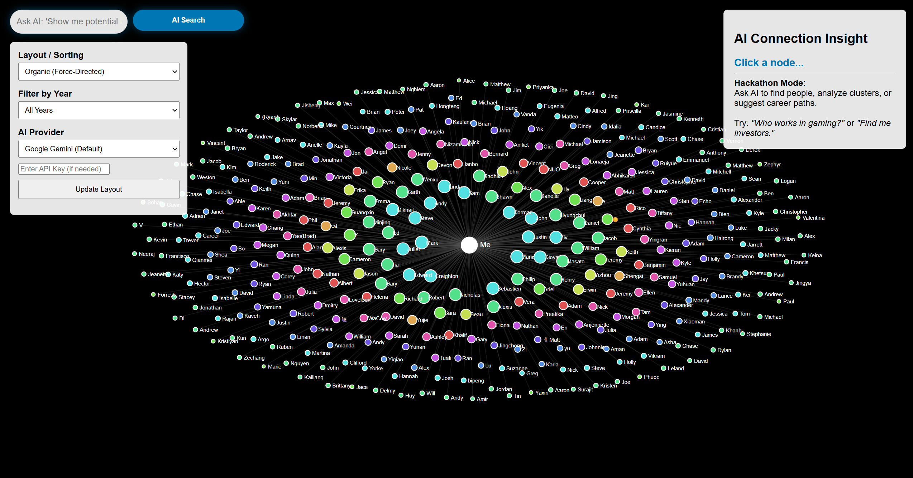

# LinkedIn Connection Visualizer

A visualization of your LinkedIn network, using AI to help you discover meaningful connections and opportunities.

## Inspiration

I was recently looking for a job and found a company I really wanted to work for. I looked them up on LinkedIn and noticed that one of their employees was a **2nd-degree connection**. She wasn't connected to me, but she was connected to a friend of mine.

I then reached out to our mutual connection to ask for an introduction. It made me realize that **LinkedIn data is a goldmine for deepening real-world relationships**, not just collecting numbers.


## 📸 Screenshot



## 🚀 Getting Started

### Prerequisites

- A modern web browser (Chrome, Firefox, Edge, Safari)
- Your LinkedIn connection data exported as CSV files
- OpenAI or Gemini API Key (for AI features)

### Getting API Keys

To use the AI-powered search features, you'll need an API key from either Google Gemini or OpenAI:

#### Option 1: Google Gemini API Key (Recommended - Free tier available)

1. Go to [Google AI Studio](https://makersuite.google.com/app/apikey) or [Google Cloud Console](https://console.cloud.google.com/)
2. Sign in with your Google account
3. Navigate to "APIs & Services" → "Credentials"
4. Click "Create Credentials" → "API Key"
5. Copy your API key (starts with `AIza...`)
6. **Note**: Gemini offers a free tier with generous rate limits

#### Option 2: OpenAI API Key

1. Go to [OpenAI Platform](https://platform.openai.com/)
2. Sign up or log in to your account
3. Navigate to [API Keys](https://platform.openai.com/api-keys)
4. Click "Create new secret key"
5. Give it a name (e.g., "LinkedIn Visualizer")
6. Copy your API key (starts with `sk-...`)
7. **Note**: OpenAI requires a paid account with credits

**Security Tip**: Never share your API keys or commit them to version control. Enter them only in the app's interface when needed.

### Installation

1. Clone this repository:
```bash
git clone <your-repo-url>
cd linkedin-connection-visual
```

2. Export your LinkedIn data:
   - Go to LinkedIn Settings → Data Privacy → Get a copy of your data
   - Select "Connections" and "Profile" data
   - Download and extract the CSV files

3. Place your CSV files in the project directory:
   - `Connections.csv` - Your LinkedIn connections
   - `Profile.csv` - Profile information (optional, note: singular "Profile", not "Profiles")

4. Open `index.html` in your web browser

5. Add your API key for AI analysis

## 🔒 Privacy & Security
- **No Data Storage**: Your data is never sent to any server (except for AI API calls with minimal metadata)
- **Local Files Only**: CSV files are read directly from your local file system


## ⚠️ Important Notes

- **API Keys**: The project includes a default API key for demonstration purposes. For production use, you should:
  - Use your own API keys
  - Never commit API keys to version control

- **CSV Files**: The `Connections.csv` and `Profile.csv` files may contain personal data. Consider adding them to `.gitignore` if you plan to share this repository.


## 📄 License

This project is open source and available under the [MIT License](LICENSE).

## 🙏 Acknowledgments

- Built for exploring the power of network visualization and AI-assisted discovery
- Inspired by the value of warm introductions in professional networking

